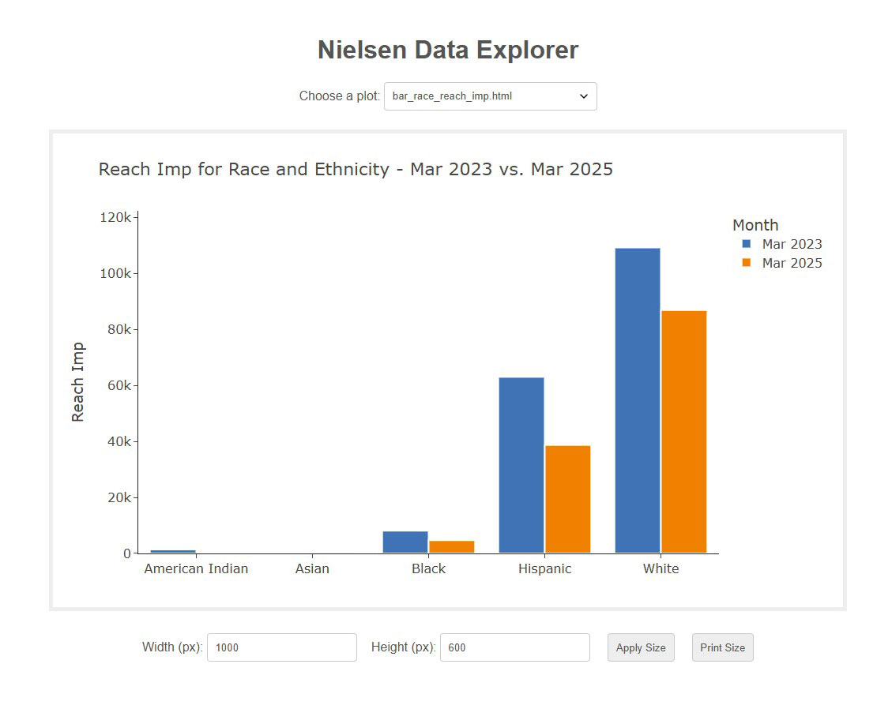
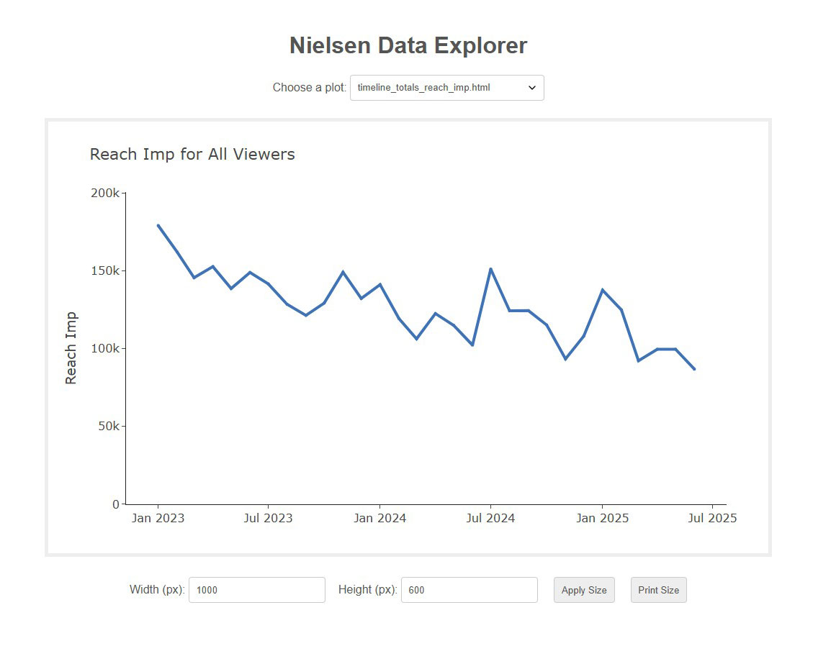

# Nielsen Data Explorer

A Python application to analyze and visualize audience data available from Local Nielsen TV Dashboards for PBS.

Stations have access to average weekly reach and frequency by month, with the ability to segment by age, income, race and ethnicity, and dayparts.

Using raw data downloaded from Nielsen's dashboard, this app produces standard interactive timelines and bar charts using Plotly, but also creates age and income brackets that do not overlap, and allows timelines beyond a year.

Opening `index.html` as a local web page in a browser displays a dashboard, including a dropdown to select generated graphs.



### Data Setup

- Downloaded a CSV file from the Interactive Pivot Table at the bottom of the Nielsen dashboard
- Add CSV file to `data` directory
- At the top of `main.py`, add the CSV file name to `DATA_FILE`, i.e. `DATA_FILE = '2023-01_2025-03.csv`
- Look for results, including Plotly HTML charts, in the `output` directory

Learn about the data and dashboard:

- [Nielsen Local Data and Dashboard Guide (PDF)](docs/Nielsen-Local-TV-Dashboard.pdf)
- [Nielsen Local Data and Dashboard FAQ (PDF)](docs/Nielsen-Local-TV-Dashboard-FAQ.pdf)

### Code Setup

This application uses a Conda environment to manage dependencies. You get it at [Anaconda](https://www.anaconda.com/download/) or [Miniconda](https://docs.anaconda.com/miniconda/).

The environment is defined in `environment.yml`. The `name` is `nielsen-data-explorer`, which can be changed.

In an Anaconda Prompt, from the application's root directory, there are two options to set up the environment:

- Option 1, system-wide environment:

  - **Create Environment:** `conda env create -f environment.yml`
  - **Activate Environment:** `conda activate <name>`
  - **Update Environment:** `conda env update -f environment.yml --prune`

- Option 2, working-directory environment:

  - **Create Environment:** `conda env create -p venv -f environment.yml`
  - **Activate Environment:** `conda activate ./venv`
  - **Update Environment:** `conda env update -p ./venv -f environment.yml --prune`



### Commands

| Argument          | Short | Default          | Description                                                      |
| ----------------- | ----- | ---------------- | ---------------------------------------------------------------- |
| `--metric`        | `-m`  | `reach_imp`      | Metric to plot (`reach_imp`, `"reach%"`, `avg_freq`, `grp_imp`)  |
| `--filter`        | `-f`  | `totals`         | Filter from `config/` (e.g., `age-brackets`, `dayparts`, `race`) |
| `--plot`          | `-p`  | `timeline`       | Type of plot (`timeline`, `bar`)                                 |
| `--month`         |       | _latest in data_ | Month to plot, formatted as `YYYY-MM` (defaults to latest)       |
| `--compare-month` |       | `None`           | Optional comparison month, formatted as `YYYY-MM`                |
| `--dashboard`     | `-d`  |                  | Update and open local index.html dashboard                       |

Examples:

- Reach impression totals in a timeline for all months  
  `python main.py`

- Reach percentages for dayparts in a timeline for all months  
  `python main.py --filter dayparts --metric "reach%"`

- Reach impressions for age brackets in a timeline for all months  
  `python main.py --filter age-brackets`

- Reach impressions for income brackets in a bar chart for most recent month in data  
  `python main.py --plot bar --filter income-brackets`

- Reach impressions for income brackets in a bar chart for March 2025  
  `python main.py --plot bar --filter income-brackets --month 2025-03`

- Reach impressions for races and ethnicity in a bar chart for March 2023 and March 2025  
  `python main.py --plot bar --filter race --month 2025-03 --compare-month 2023-03`

### Directory Structure

```
nielsen-data-explorer/
├─ config/          # json filters for data plots
├─ data/            # input CSV
├─ docs/
├─ output/
│  ├─ csv/
│  └─ html/
├─ src/
│  ├─ __init__.py
│  ├─ filters.py          # filtering logic
│  ├─ plotting.py         # plotting helpers
│  ├─ update_dashboard.py # updates <option> elements in index.html
│  └─ utils.py            # data prep
├─ index.html             # web page to display graphs
├─ main.py
```

### References

- [Nielsen Local Data and Dashboard Guide (PDF)](docs/Nielsen-Local-TV-Dashboard.pdf)
- [Nielsen Local Data and Dashboard FAQ (PDF)](docs/Nielsen-Local-TV-Dashboard-FAQ.pdf)
- [Plotly Express](https://plotly.com/python/plotly-express/)
- [Pandas](https://pandas.pydata.org/)
- [Python argparse](https://docs.python.org/3/library/argparse.html)
- [Anaconda](https://www.anaconda.com/download/)
- [Miniconda](https://docs.anaconda.com/miniconda/)
